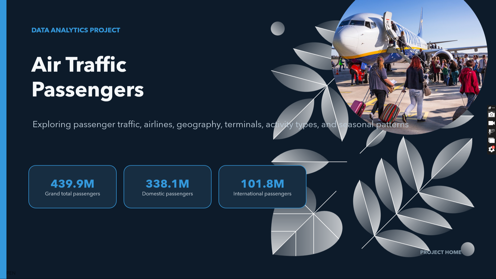

# ✈️ Air Traffic Passenger Analysis

## Project Overview
This final project explores an air traffic passenger dataset using Python, Pandas, and Plotly. The notebook performs data inspection and cleaning, then answers a set of analytical questions through interactive visualizations.

## Analysis Questions
1. How has passenger traffic changed over time?
2. Which airlines have the highest passenger counts?
3. What is the geographic distribution of passengers?
4. How do passenger counts vary by terminal and boarding area?
5. What is the impact of different activity types on passenger counts?
6. How do price categories affect passenger counts?
7. Which months have the highest passenger traffic?
8. How have adjusted passenger counts changed over time?
9. Which boarding areas are the busiest?
10. What is the trend of international vs. domestic passenger traffic?

## Dataset
The notebook uses `air_traffic_data.csv`. The dataset contains fields including Activity Period, Operating Airline, Published Airline, GEO Summary, GEO Region, Activity Type Code, Price Category Code, Terminal, Boarding Area, Passenger Count, Adjusted Passenger Count, Year, and Month.

The uploaded notebook does **not** include the CSV itself, so place the dataset at:

```text
data/air_traffic_data.csv
```

## Data Preparation
The notebook includes steps to:
- inspect the dataset and column data types
- check duplicate rows
- check missing values
- fill missing airline IATA codes with `NaN`
- create datetime information from year/month and activity period
- aggregate passenger counts for different dimensions

## Visualizations
The project uses Plotly to create interactive charts, including:
- line charts for passenger trends
- bar charts for airlines, activity types, price categories, months, and boarding areas
- pie charts for geographic distribution
- a choropleth-style geographic visualization
- a terminal/boarding-area heatmap
- domestic vs. international trend comparisons

## Technologies
- Python 3
- Pandas
- Plotly Express
- Plotly Graph Objects
- Jupyter Notebook / Google Colab

## How to Run
### Option 1 — Google Colab
1. Upload the notebook and dataset to Google Colab.
2. Ensure the CSV is available at `data/air_traffic_data.csv`, or update the path in the data-loading cell.
3. Run the notebook from top to bottom.

### Option 2 — Local Jupyter
```bash
pip install -r requirements.txt
jupyter notebook Final_Project_Air_Traffic.ipynb
```

## Project Structure
```text
air-traffic-passenger-analysis/
├── Final_Project_Air_Traffic.ipynb
├── data/
│   └── air_traffic_data.csv   # add the dataset here
├── requirements.txt
├── .gitignore
└── README.md
```

## Notes
This repository contains the final analysis notebook. The README describes the dataset and workflow based on the notebook contents. Numerical findings should be read directly from the notebook outputs and visualizations.

Air_traffic_Home_slide.png

</a>
